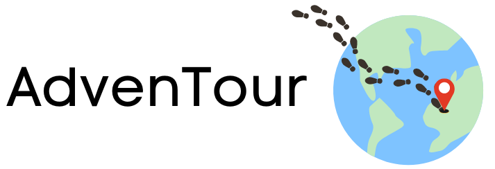

## AdvenTour 
Hello! :wave: Welcome to AdvenTour, an exciting travel web-app that allows you to uncover hidden travel destinations through an interactive experience known as Country Roulette!  

<div style="align: center;">
  
</div>

<div style="align: center;">
<a href="http://txirvpjzag.eu09.qoddiapp.com">Visit our Site!</a> 
</div>

### 👩‍💻 Contributors 👨‍💻 

| Ruby Chen  | Gaganjit Heer| Victor Fung | Angela Yu |
---| --- | --- | --- |


## Project Description
✈ The goal of AdvenTour is to help travelers discover unique and authentic experiences in places experiencing under-tourism using AI. 

## Technologies Used
Frontend: Bootstrap 5.3, CSS3

Backend: Node.js, EJS, JavaScript 

Database: MongoDB

API: OpenAI API GPT-3.5, Unsplash API     

Dataset: https://www.kaggle.com/datasets/abdulhamitcelik/international-tourism-receipts 
- Our idea was inspired by this dataset. The responses generated by ChatGPT are cross-checked with the values in this dataset. This validation helps to verify the correctness and consistency of the information we provide.    

## Files
```
Top Level Folders and their Subfolders:
├── public                                  # Folder for scripts, styles, images, audio
|    └──js                                  # Folder for JavaScript files
|        └──scripts.js                      # JavaScript files
|    └──styles                              # Folder for CSS stylesheets
|        └──styles.css                      # CSS stylesheets
|    └──images.png audio.mp4 images.gif     # Images, audio, gifs
├── views                                   # Folder for EJS files
|    └──templates                           # Folder for header, footer, loading EJS files
|        └──navbar.ejs                      # Template ejs files
|    └──pages.ejs                           # Individual ejs files
├──.gitignore                               # Git ignore file                
├── README.md                               # README
└── index.js                                # Entry point for Node.js app
```    

## Running our Project 
### Prerequisites
- MongoDB Atlas
    1. [create a MongoDB account](https://www.mongodb.com/)  
    2. Install MongoDB 
       -   *optional* Studio3T 
    3. Create your database
    4. Establish a connection to your MongoDB Server to your IDE
   
### Installation
1. Clone our repo
    ```
    git clone https://github.com/rubyred139/2800-202310-BBY02.git
    ```
2. Obtain API keys from:
- [OpenAI](https://platform.openai.com/account/api-keys)
- [Unsplash](https://unsplash.com/developers)
3. Install 
- npm packages
    ```
    npm install 
    ```
4. Create a ```.env``` file and set up your environment variables 
   - [Generate GUIDs here!](https://guidgenerator.com/online-guid-generator.aspx)
    ```
    MONGODB_HOST = 'YOUR MONGODB HOSTNAME'
    MONGODB_USER = 'YOUR MONGODB CREDENTIALS USERNAME'
    MONGODB_PASSWORD = 'YOUR MONGODB CREDENTIALS PASSWORD'
    MONGODB_DATABASE = 'YOUR DATABASE NAME'
    MONGODB_SESSION_SECRET = 'YOUR GUID'
    NODE_SESSION_SECRET = 'YOUR GUID' 
    OPEN_AI_KEY = 'YOUR OPENAI API KEY'
    UNSPLASH_ACCESSKEY = 'YOUR UNSPLASH API KEY'
    ```
5. Run the app!  
   ```
   node index.js
   ```

## How to Use AdvenTour's Features

//

## Credits, References, Licenses
//

Credits:
CSS Framework- Bootstrap 5.3
Font- https://fonts.googleapis.com/css2?family=Comfortaa:wght@300&display=swap
Google Material Icons- (https://fonts.google.com/icons) 
Bootstrap Icons - https://icons.getbootstrap.com/?q=eat 
Flaticon created by Iconjam - https://www.flaticon.com/free-icons/backpack (activity icon)
Flaticon created by Freepik - https://www.flaticon.com/free-icons/restaurant (food icon)
Flaticon created by Luvdat - https://www.flaticon.com/free-icons/dices (Dices icon)
Flaticon created by Freepik -https://www.flaticon.com/free-icons/language (language icon)
Logo Creation- made using Canva
Easter Egg image - made using Canva
Sound effects - mashup https://www.youtube.com/watch?v=aqCxlxclyzo&pp=ygUKZHVjayBzb3VuZA%3D%3D and https://www.youtube.com/watch?v=Uj93hicGDNc&t=116s
Loading wheel - https://codepen.io/ivillamil/pen/xxaEdB
Profile page images - made by nawazwazwaz on VectorStock - https://www.vectorstock.com/royalty-free-vectors/vectors-by_nawazwazwaz
404 page image - Image by pikisuperstar on Freepik - https://www.freepik.com/free-vector/gradient-summer-background_13758040.htm#query=vacation%20background&position=43&from_view=search&track=ais#position=43&query=vacation%20background

Landing Page images-
1. Sibenik, Croatia Photo by Assedrani Official  from Pexels: https://www.pexels.com/photo/aerial-shot-of-sibenik-croatia-13385470/
2. Krong Siem Reap, Cambodia Photo by Lukas Kloeppel: https://www.pexels.com/photo/silhouette-of-trees-near-body-of-water-2416576/
3. Havana, Cuba Photo by Sophia: https://www.pexels.com/photo/colorful-historic-buildings-in-city-square-5211643/
Featurette gifs made using Canva 
 
## Use of AI Services 
//

AI and API Usage:
OpenAI 
Unsplash (image generator) 

## 🤝Contribution
Contributions to our project is greatly appreciated! We hope to learn, be inspired, and collaborate with passionate individuals like yourself! 
Join us and help shape the future of our project. 

1. Fork our repo
2. Create a feature branch with your own features 
3. Stage, commit, and push your files
4. Open a pull request 

## Contact Information

